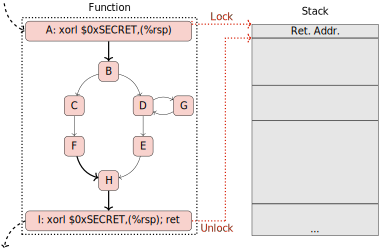

# GTIRB Stack Stamp

TRL: 6

Transform to apply 'stack stamping' protections to a binary.



## Abstract

Stack stamping is a technique to help mitigate ROP style attacks.  This is done
by 'stamping' the return address on the stack, thus encrypting it.  Before it is
popped off the stack and used, it is decrypted by 'unstamping' it.  This can be
an efficient protection, as no registers are needed, and while flags are affected,
they are only affected at function entry/exits where they do not need to be
preserved.  By encoding and decoding this return address, an attacker has a more
difficult task, since the replacement data would need to be properly encoded,
such that when it is unstamped, it results in the desired address.

## Building

This repostiory contains three implementations of stack-stamping in three
different languages:

### C++

This transform depends on the following libraries:

* [Boost](https://www.boost.org/) (version 1.67 or later)
* [GTIRB](https://github.com/grammatech/gtirb)
* [Capstone](https://github.com/aquynh/capstone)
* [Keystone](https://github.com/keystone-engine/keystone)

Ensure they are installed before compiling the C++ version of the transform.
Building from source also depends on [CMake](https://cmake.org) being installed.

#### Options

We add the folliwng CMake options during building:

* `GTIRB_STACK_STAMP_ENABLE_TESTS`: Set to `OFF` to disable the downloading of
  Google Test and the building of the test executable. `ON` by default.
* `GTIRB_STACK_STAMP_BUILD_SHARED_LIBS`: Set to `OFF` to build static libraries
  instead of dybnamic ones. `ON` by default.

#### On Linux

```sh
cmake -Bbuild ./
cd build
make
```

The generated command-line utility will then be available in `build/bin`.

#### On Windows

Currently, [some](https://github.com/keystone-engine/keystone/issues/471)
[issues](https://github.com/keystone-engine/keystone/issues/472) are preventing
Keystone from being built on Windows, so the C++ version of gtirb-stack-stamp is
buildable on Linux only for the time being.

#### Tests

Our CMake automatically downloads a local copy of [Google Test](https://github.com/google/googletest)
and produces a test executable. To run it:

```sh
build/bin/test-gtirb-stack-stamp
```

You will need [gtirb-pprinter](https://github.com/grammatech/gtirb-pprinter)
and [ddisasm](https://github.com/grammatech/ddisasm) on your PATH.

### Python

The Python transform requires some dependnecies to be installed:

```sh
pip3 install gtirb-capstone gtirb-functions capstone keystone-engine
```

To starting using it, run:

```sh
python3 setup.py develop
```

To invoke the command line utility thus generated:

```sh
python3 -m gtirb_stack_stamp
```

### Common Lisp

TODO

## Copyright and Acknowledgments

Copyright (C) 2020 GrammaTech, Inc.

This code is licensed under the MIT license. See the LICENSE file in
the project root for license terms.

This project is sponsored by the Office of Naval Research, One Liberty
Center, 875 N. Randolph Street, Arlington, VA 22203 under contract #
N68335-17-C-0700.  The content of the information does not necessarily
reflect the position or policy of the Government and no official
endorsement should be inferred.
